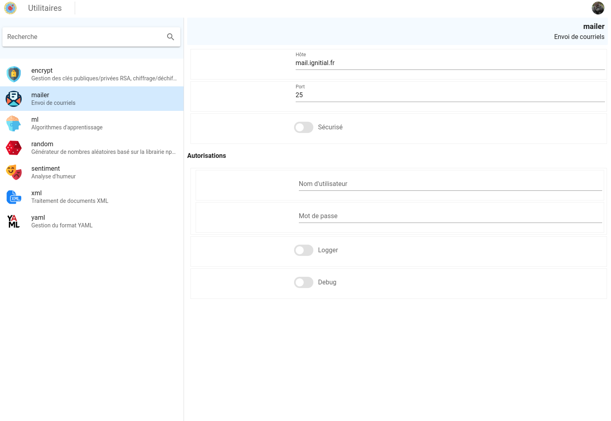

# utils: Ignitial.io service

Utilities service providing basic features mainly provided by external libraries:
- mailing
- parser/encoders
- encrypting
- algorithms
- etc.

WIP !



## Work with the repository

The following _npm run_ targets are available:  
- _client:serve_: serves client source code through webpack dev server
- _client:build_: builds service client source code (using webpack)
- _server:start_: starts service server side
- _dev:standalone_: runs service without Docker container
- _dev:start_: starts development containers, including IIOS application for intergrated testing
- _dev:hr:start_: starts development containers with sort of hot reaload
- _dev:hr:reload_: used for restarting container on reload trig: do not use it directly
- _dev:stop_: stops and cleans up development deployment
- _prod:start_: starts production service container
- _prod:stop_: stops and cleans up production service container
- _docker:build:minikub_: buils Docker image directly inside minikube environment (minikube must be installed and started)
- _docker:publish:private_: publishes Docker image to an eventually private Docker registry (_registry.ignitial.io_
  is private: you must change this, unless we gave you an access to it)  
- _docker:publish:public_: publishes Docker image to Docker Hub registry (_ignitial/_
  means that this uses _ignitial_: you must change this, unless we gave you an access to it)
- _docker:publish:minikube_: publishes Docker image to local minikube (copy existing image instead of building it)

## Develop

Add server files in the _server_ folder and client ones in _src_.

You can add any dependency thanks to _npm_. The only constraint is to have
dependencies that work with webpack, if used client side.

You can run development environment as below:

```bash
# only first time, or changes for server part, since client volume is mounted
# based on local folder
npm run docker:build

npm run dev:start:full

# then stop it and remove related containers
npm run dev:stop:full
```

You can use hot reload for client side as below:

```bash
npm run dev:start:hr

# then stop it and remove related containers
# ^CTRL-C
npm run dev:stop:full
```

## Known issues

- Hot reload needs a delay when restarting container: service discovery inverts
destroy and create message if no delay: hot reload needs more than 2 seconds to
operate (~5s on core i7)
